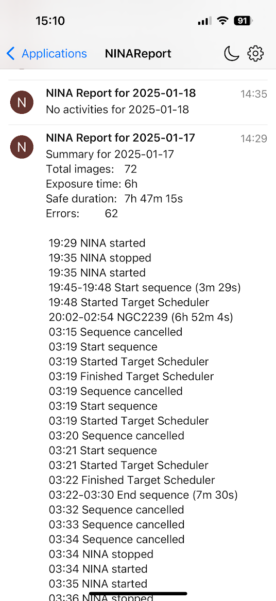

# NINA Log Report

## Purpose
The NINA Log Report is a Python script designed to create a concise report about the previous night's astronomical observations. The primary purpose is to send a push notification via Pushover, providing a quick overview of the night's activities, including total images taken, exposure time, safe duration, and any errors encountered. This helps astrophotographers to easily review the night's performance and identify any issues.


## Installation

1. Clone the repository:
    ```sh
    git clone https://github.com/yourusername/NINA-Report.git
    cd NINA-Report
    ```

2. Create a virtual environment and activate it:
    ```sh
    python -m venv venv
    source venv/bin/activate  # On Windows use `venv\Scripts\activate`
    ```

3. Install the required dependencies:
    ```sh
    pip install -r requirements.txt
    ```

## Configuration

Make sure to update the `secrets.json` file with your Pushover API token and user key:
```json
{
    "PUSHOVER_APIKEY": "YOUR_PUSHOVER_TOKEN",
    "PUSHOVER_USERKEY": "YOUR_PUSHOVER_USER_KEY"
}
```

## Usage

1. Update the configuration file with your Pushover API token and user key.

2. Run the script:
    ```sh
    python nina-report.py
    ```

3. The script will parse the log files and send a push message with the report.

```
usage: nina-report [-h] [-n NIGHT] [-P] [-p PATH] [-o PATTERN] [-s] [-c CLEANUP]

options:
  -h, --help            show this help message and exit
  -n NIGHT, --night NIGHT
                        0=last night, 1=the night before etc.
  -P, --pushover        Send report to pushover
  -p PATH, --path PATH  Path to NINA log files (Default = %localappdata%/NINA/Logs)
  -o PATTERN, --pattern PATTERN
                        Pattern to use for parsing. Currently supported values are FOLDER2, skyimages, AMOS
  -s, --silent          Don't send empty message
  -c CLEANUP, --cleanup CLEANUP
                        Cleanup log files older than X days.
                        
```
## Examples





